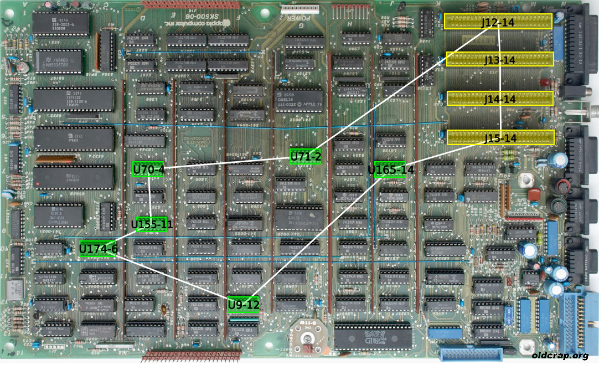
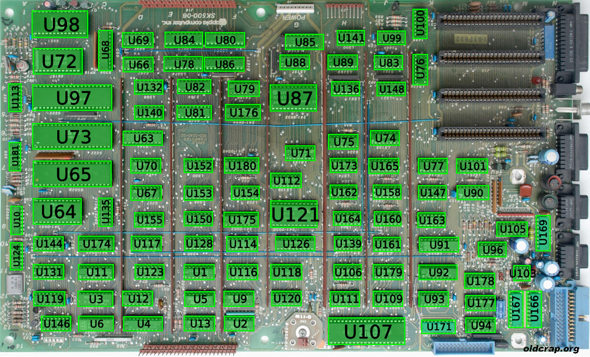
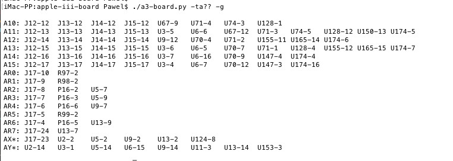

# Retro Board Schematic Tools

The purpose of this project is to provide tools and data that help in navigating the **retro-computing** motherboard's circuitry.

<p align="left">
<a href="./pictures/demo-screen-1.jpg"></a>
<a href="./pictures/demo-screen-2.jpg"></a>
</p>
<a href="./pictures/demo-screen-3.jpg"></a>

It is a work in progress that just started. Contributions are welcome!

You are also welcome to visit my collection of vintage computers:

  * [oldcrap.org](https://oldcrap.org) 
  * Facebook: [Old Crap Vintage Computing](https://www.facebook.com/oldcrap.org/).

## Content:

  * [`data`](./data) - post-processed **JSON** files describing boards and components
  * [`original`](./original) - stuff related to the original pre-processed content
  * [`pictures`](./pictures) - pictures of the boards and components
  * [`board.py`](./a3-board.py) - script to display and visualize board information

### board.py

With this script it is possible to display information about board components and traces. Script loads and parses a board wire list from a **JSON** file. JSON files are contained in [`data`](./data) directory.

**SYNTAX:**

```
./board.py [options] <board-file.json>
```

Where:

```
board-file.json - a file describing the board to query
```

**OPTIONS:**

```
-g or --graphics
```

Display an image with the motherboard and mark the location of components.

```
-h or --help
```
Display tool help (usage).

```
-c or --component <ID1>,<ID2>,...
```

Select IDs of components to display information about. Only one of `-t, -c` can be selected at the same time.

  * Single ID is case insensitive, e.g.: `U128` or `r5`
  * Single ID can use file-style wildcards, e.g.: `U*` or `C1?`
  * Multiple IDs can be separated by commas, e.g.: `U128,R5,C10` or with wildcards: `U10?,R*,X2`

```
-s or --sequential
```

If multiple components are selected either by providing a wildcard or more than one ID, by default the components are combined and a single trace is displayed covering all components.

With `-s` option, the components can be displayed one by one and an individual trace will be shown for each component.

```
-t or --trace <ID1>,<ID2>,...
```

Selects IDs of traces on board. Only one of `-t, -c` can be selected at the same time.

  * Single ID is case insensitive, e.g. `sync` or `A13`
  * Single ID can use file-style wildcards, e.g.: `A1?` or `PRAS*`
  * Multiple IDs can be separated by commas, e.g.: `A1,A2,A3` or with wildcards: `A*,SYNC?`
